# Patrones y políticas de acceso
Utilización de patrones y políticas de acceso en java.

## Instalación 
Importar proyecto en IDE de Java

Eclipse:  
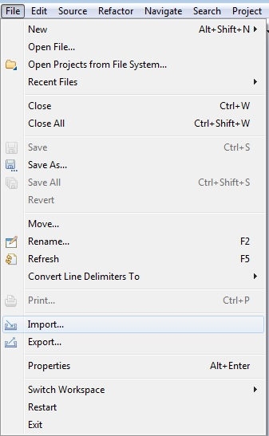

Netbeans:  
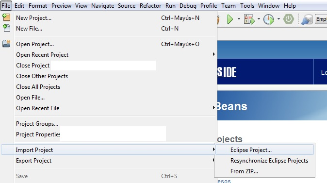

## Ejemplo de uso 
Ejecutar el programa como aplicación de java (genera los documentos de lectura automáticamente), en eclipse o consola  por el fichero .jar e introducir los datos que se solicitan:   
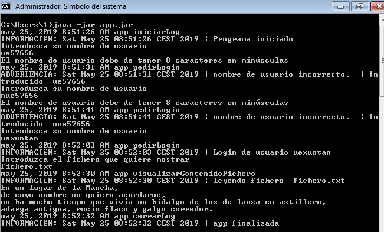  
Comprobar que se han creado los ficheros (log y fichero de lectura) 
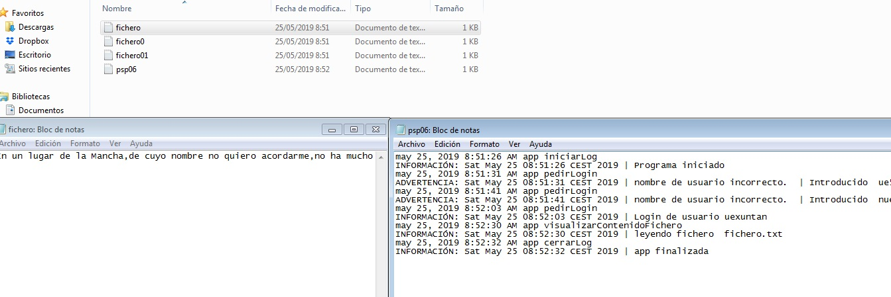   
 
## Configuración políticas
Compilar GetProps y generar el .jar:   
  
Generación de claves 
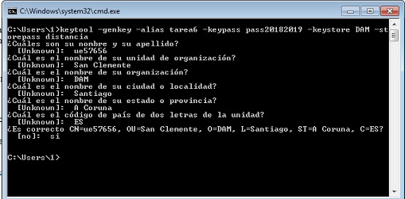   
Firma del .jar 
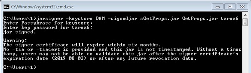
Exportar certificado
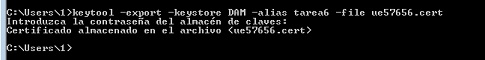
Importar certificado en proyecto
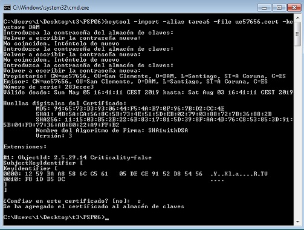
Configuración de java.policy en el policytool
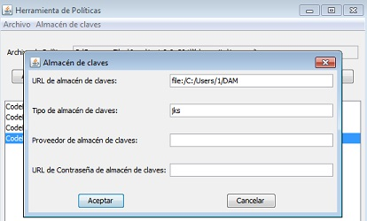
Agregar políticas
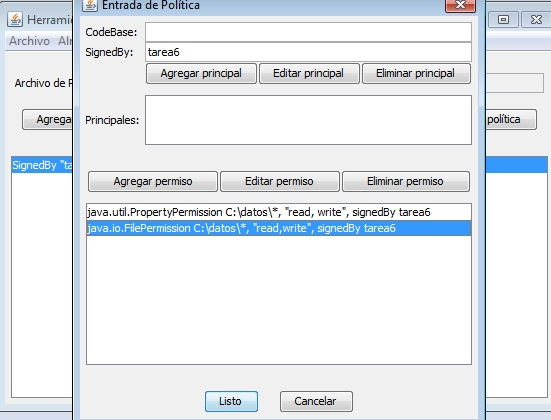
Ejecución (he probado a darle diferentes permisos, todos los permisos, cmd como administrador, pero siempre da un error de permisos, diferente según el caso)
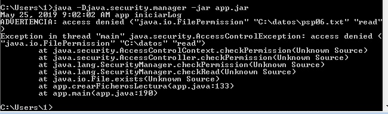
 

## Configuración de desarrollo
Requiere instalación de Java 8, y de un navegador web. 

## META
ue57656@edu.xunta.es
Distributed under the CreativeCommons by-nc license. See https://creativecommons.org/licenses/by-nc/2.0/es/  for more information.
